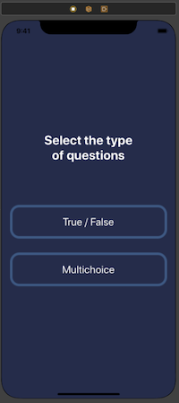
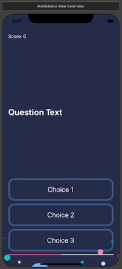
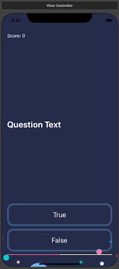
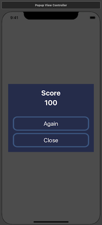

# Quizzler
A trivia quiz iOS App Native

Applying the concepts:

* IBOutlets & IBActions
* AutoLayouts
* Structures
* Protocols & Delegates
* Replace rootViewController
* Modals
* Model View Controller Design Pattern (MVC)

# Functionality
It's a quiz app that allows you to choose a question and you can see your progress as well as see your score.
It's can select the type of questions, between multichoice and questions True/false.

## Screenshots

|  Home      |  Multichoice      |  True / False      |  Modal      |
|------------|-------------|------------|-------------|
|  |    |  |    |

